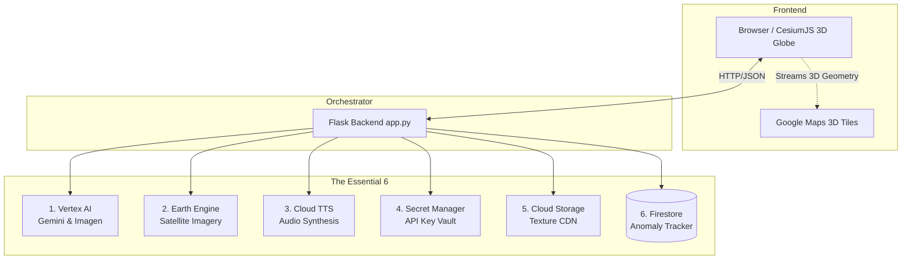
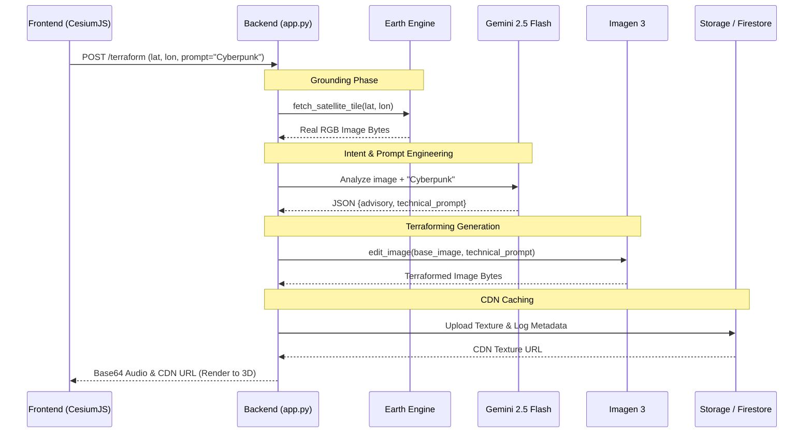

# ☁️ Infinite Flight Simulator: Cloud Architecture Summary

This document provides a definitive architectural summary of the **Infinite Flight Simulator**, detailing the "Essential 6" Google Cloud services used. The included Mermaid diagrams visualize the two most advanced paradigms in this project: **Visual RAG** (Terraforming) and **Agentic Workflows** (The Control Tower).

## 🏆 The "Essential 6" Cloud Services

1.  **Vertex AI (Gemini 2.5 Flash & Imagen 3):** The multimodal brain. Gemini acts as an analyst (writing pilot advisories) and an Agent (orchestrating radar tools). Imagen 3 acts as the terraforming engine, performing geographic image-to-image translation.
2.  **Google Earth Engine:** The physical grounding layer. It provides live, cloud-free Sentinel-2 satellite imagery so the AI generates over real street layouts, preventing "blank canvas" hallucinations.
3.  **Cloud Text-to-Speech (TTS):** The immersion engine. Uses `Studio` and `Journey` voices to give the Pilot and the Air Traffic Control Agent distinct, lifelike audio presence.
4.  **Cloud Firestore & Cloud Storage:** The Anomaly Tracker database and Global Texture CDN. Firestore acts as a global NoSQL sync layer, allowing the ATC Agent to "see" terraforming anomalies created by other pilots in real-time. Cloud Storage caches the heavy 4K textures generated by Vertex AI so they can be instantly retrieved later.
5.  **Secret Manager:** The Zero-Trust vault. Securely injects the Google Maps Platform API key into the frontend at runtime, preventing credential leaks.
6.  **Cloud Logging:** The observability layer. Configured to capture all application events and errors seamlessly into Google Cloud's Operations Suite.

*(Note: The frontend heavily relies on the **Google Maps Platform Photorealistic 3D Tiles API** to render the 3D globe.)*

---

## 📊 Architecture Visualizations

### 1. High-Level System Overview
This diagram illustrates how the Flask orchestrator routes traffic between the frontend (CesiumJS) and the Essential 6.



### 2. The Terraforming Pipeline (Visual RAG)
This sequence diagram shows how we ground the generative AI (Imagen 3) using real physical data (Earth Engine), guided by an LLM (Gemini 2.5 Flash). This is RAG for Vision.



### 3. The Control Tower Agent (ADK & Parallel Tool Calling)
This diagram illustrates the "WHERE AM I?" feature. It highlights how `gemini-2.5-flash` acts autonomously, pausing its generation to execute tools in parallel to gather real-world visual telemetry and database records before synthesizing a final spoken response.

```mermaid
graph TD
    User[Pilot Clicks 'WHERE AM I?'] --> API[POST /locate]
    API --> Agent[Control Tower Agent<br>gemini-2.5-flash]
    
    subgraph Agentic Loop (Parallel Tool Calling)
        Agent -->|Suspend Generation| Tools{Decision Engine}
        Tools -->|Call Tool 1| T1[get_telemetry]
        Tools -->|Call Tool 2| T2[scan_anomaly_tracker]
        
        T1 -.->|Identify Landmark| Vision[AIVisionService]
        T2 -.->|Query Recent Anomalies| DB[(Firestore)]
        
        Vision -.->|Returns: Golden Gate Bridge| Tools
        DB -.->|Returns: Mars Colony 4 miles North| Tools
    end
    
    Tools -->|Synthesize Data| Agent
    Agent -->|Generates Final Text| TTS[Cloud TTS<br>en-US-Journey-D]
    TTS -->|MP3 Bytes| User
```