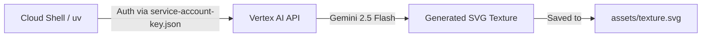

# Module 1: Cloud Setup & The "Icebreaker"

Before we build the flight simulator's brain, we need to ensure our environment is correctly wired to Google Cloud.

## 🛠 The Setup
You will perform all development inside Google Cloud Shell, which comes pre-installed with the tools you need.

1.  **Activate Cloud Shell:** Click the `>_` icon in the top right of your Google Cloud Console.
2.  **Get Your Maps API Key:** 
    *   In the Cloud Console search bar, type "Google Maps Platform Credentials".
    *   Click **Create Credentials** -> **API Key** and copy it. You will need this in a moment.
    *   *(Note: The Photorealistic 3D Tiles API must be enabled for this key).*
3.  **Clone & Prepare:** Run this in your Cloud Shell terminal:
    ```bash
    git clone https://github.com/jorgeajimenez/ai-flight-simulator.git
    cd ai-flight-simulator
    uv sync
    ```
4.  **Run the Automator:** We've built a script that handles creating your Service Account, enabling the APIs (Vertex AI, Earth Engine, Secret Manager, TTS), and securely storing your Maps API key.
    ```bash
    bash scripts/setup_gcp.sh
    ```
    *When prompted, paste your Google Maps API Key. The script will securely lock it inside Google Cloud Secret Manager.*
5. **Earth Engine Terms:** Finally, you must accept the Earth Engine terms. Visit **[earthengine.google.com/signup](https://earthengine.google.com/signup)** and click "Register".

---

## 🎨 The Icebreaker: Your First Generative Texture
Before we touch the backend code, let's prove the AI is working. We will use **Gemini 2.5 Flash** to generate a custom 3D building texture that will be used throughout the simulator.

**Run the Icebreaker Script:**
```bash
uv run python scripts/generate_texture.py "Cyberpunk hacker apartment block..."
```

**What just happened?**
1.  The script sent your prompt to the **Vertex AI GenerativeModel** (Gemini 2.5 Flash).
2.  Gemini generated a seamless, high-contrast SVG vector texture using CSS/SVG glow effects.
3.  The script saved it to `assets/texture.svg`, which the simulator uses for every skyscraper.

---

## Architecture: The Cloud Handshake
The diagram below shows how your Cloud Shell environment is communicating with Vertex AI using the credentials we just generated.

