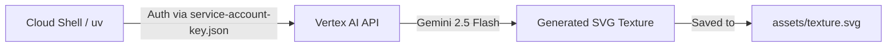

# Module 1: Cloud Setup & The "Icebreaker"

Before we build the flight simulator's brain, we need to ensure our environment is correctly wired to Google Cloud.

## The Setup
1.  **Activate Cloud Shell:** Click the `>_` icon in the top right of your Google Cloud Console.
2.  **Clone & Prepare:**
    ```bash
    git clone https://github.com/jorgeajimenez/ai-flight-simulator.git
    cd ai-flight-simulator
    uv sync
    ```
3.  **Run the Automator:**
    ```bash
    bash scripts/setup_gcp.sh
    ```
    *Note: This script enables the Essential 6 APIs and configures your Service Account permissions.*

---

## 🎨 The Icebreaker: Your First Generative Texture
Before we touch the backend code, let's prove the AI is working. We will use **Gemini 2.5 Flash** to generate a custom 3D building texture that will be used throughout the simulator.

**Run the Icebreaker Script:**
```bash
uv run python scripts/generate_texture.py "Cyberpunk hacker apartment block..."
```

**What just happened?**
1.  The script sent your prompt to the **Vertex AI GenerativeModel** (Gemini 2.5 Flash).
2.  Gemini generated a seamless, high-contrast SVG vector texture using CSS/SVG glow effects.
3.  The script saved it to `assets/texture.svg`, which the simulator uses for every skyscraper.

---

## Architecture: The Cloud Handshake
The diagram below shows how your Cloud Shell environment is communicating with Vertex AI using the credentials we just generated.

