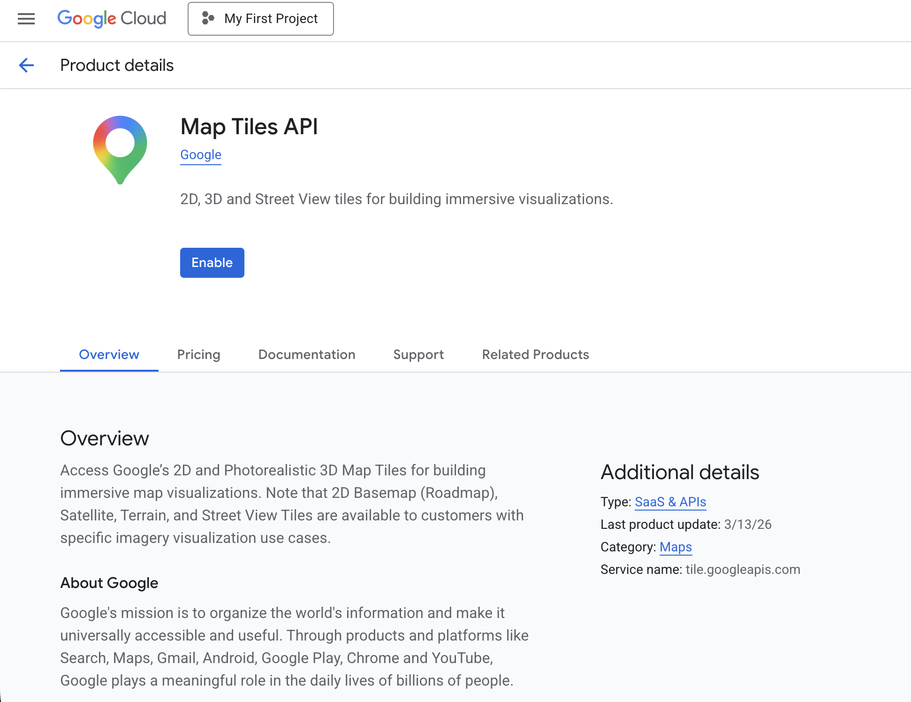
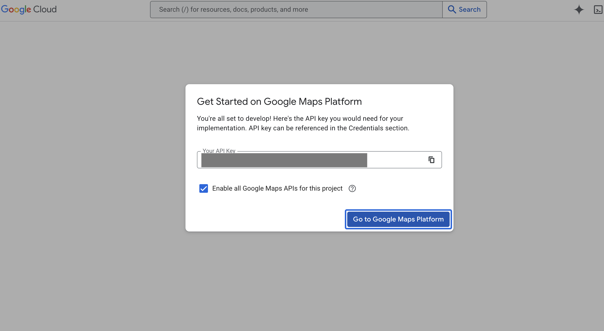
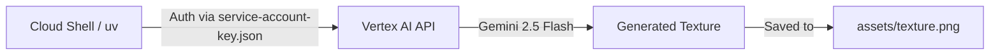

# Module 1: Cloud Setup & Initial Generation

Before building the flight simulator's brain, we need to ensure your environment is correctly wired to Google Cloud. If you are using a brand new Google account, follow these steps exactly.

## Step 1: Account Preparation & Billing

1.  **Billing Account:** You must have an active billing account. Go to the [Google Cloud Billing Console](https://console.cloud.google.com/billing) and ensure a billing account is linked to your current project.
2.  **Activate Cloud Shell:** Click the `>_` terminal icon in the top right of your Google Cloud Console. This is your primary development environment.

## Step 2: Clone & Synchronize

Google Cloud Shell comes pre-configured with most tools you need, but we will use the ultra-fast `uv` Python package manager to handle our dependencies smoothly.

**Action Marker 1.1:** Open your Cloud Shell terminal, install `uv`, clone the project, and synchronize the dependencies.

```bash
curl -LsSf https://astral.sh/uv/install.sh | sh
source $HOME/.local/bin/env
git clone https://github.com/jorgeajimenez/ai-flight-simulator.git
cd ai-flight-simulator
uv sync
```

## Step 3: Identity & Access Management (IAM)

We've provided a script to automate the creation of your Google Cloud Project, enable APIs (Vertex AI, Geocoding, Secret Manager, TTS), and configure your Service Account. 

**Action Marker 1.2:** Run the setup script in your terminal. 

```bash
bash scripts/setup_gcp.sh
```

**Pause for the Maps API Key:**
During execution, the script will automatically pause and present you with two highly visible, clickable links.

1. *While the script is paused*, hold `CTRL` (or `CMD` on Mac) and click the **STEP 1** link. This will open the Map Tiles API page for your specific project. Click the blue **ENABLE** button.



2. Next, hold `CTRL` (or `CMD` on Mac) and click the **STEP 2** link to open the Credentials page. Click **Create Credentials** -> **API Key** and copy it.



3. Go back to your Cloud Shell terminal, paste the key, and press Enter. The script will securely lock it inside Google Cloud Secret Manager.

## Step 4: Verification (The Vertex AI Handshake)

Let's verify that the AI is working before touching the code. We will use **Gemini 2.5 Flash** to generate a custom 3D building texture.

**Action Marker 1.3:** Execute the texture verification script.

```bash
uv run python scripts/generate_texture.py "Cyberpunk hacker apartment block..."
```

**Verification:** If you see `Saved texture to assets/texture.svg`, your cloud environment is structurally sound.

---

## Architecture: The Cloud Handshake

> 💡 **A Note on Mermaid Diagrams (Docs as Code)**
> Throughout this codelab, you will see `mermaid` code blocks followed by an image of a diagram. [Mermaid](https://mermaid.js.org/) is a popular open-source tool that allows engineers to generate architectural flowcharts using simple, readable text. We have intentionally included both the raw Mermaid code and the final rendered image as a pedagogical tool, so you can learn how to easily document your own AI architectures!

The diagram below shows how your Cloud Shell environment is communicating with Vertex AI using the credentials we just generated.




*Notice how `uv` authenticates via the `service-account-key.json` file we generated in the setup script. This establishes a secure, zero-trust handshake with the Vertex AI API, allowing Gemini 2.5 Flash to generate our initial SVG texture and save it locally to the assets folder. This fundamental auth flow will power the rest of our AI services.*
