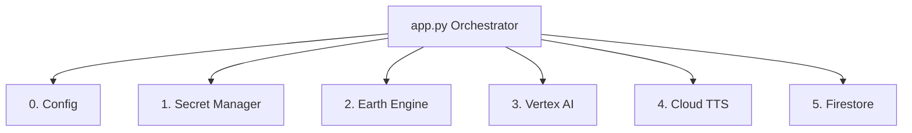

# Module 2: Enterprise Modular Architecture & TDD

In this module, we transition from a monolithic "script" to an enterprise-grade Service-Oriented Architecture (SOA). We will also adopt a **Test-Driven Development (TDD)** workflow to ensure our AI application is robust and "re-buildable."

## The "Essential 6" Stack

To scale this simulator, we've deconstructed the backend into six specialized services.



Each service has a single responsibility and is isolated for maximum testability:

1.  **Service 0 (Config):** Environment detection and logging initialization.
2.  **Service 1 (Vault):** Zero-trust secret management (Secret Manager) with in-memory caching for performance (e.g., `get_maps_api_key`).
3.  **Service 2 (Geospatial):** Real-time satellite fetching (Earth Engine).
4.  **Service 3 (AI Vision):** Multi-stage generative pipeline (Gemini + Imagen).
5.  **Service 4 (Audio):** Immersive Pilot voice synthesis (Text-to-Speech).
6.  **Service 5 (State Sync):** Shared Persistent World persistence (Firestore).

---

## The TDD Workflow

We don't just write code; we write specifications first. Our workflow for each service follows these steps:

1.  **Mocking the Cloud:** Since we don't want to make expensive API calls during every test run, we use `pytest-mock` to simulate Google Cloud responses.
2.  **Red Phase (Fail):** Write a test in the `tests/` directory that defines the expected output.
3.  **Green Phase (Pass):** Implement the minimal logic in the `services/` folder to satisfy the test.
4.  **Refactor:** Clean up the code while ensuring the tests stay green.

### Example: The Vault Service Test
We mock the `SecretManagerServiceClient` to ensure our backend handles network timeouts and fallbacks correctly without ever actually hitting the network. We also ensure our in-memory cache prevents redundant API calls.

```python
def test_get_maps_api_key_from_secret_manager(mocker):
    # Mock the Cloud SDK
    mock_client = MagicMock()
    mocker.patch("google.cloud.secretmanager.SecretManagerServiceClient", return_value=mock_client)
    
    # Simulate a successful response
    mock_response = MagicMock()
    mock_response.payload.data = b"cloud-secret-key"
    mock_client.access_secret_version.return_value = mock_response
    
    key = VaultService.get_maps_api_key()
    assert key == "cloud-secret-key"
```

## Directory Blueprint

By the end of this refactor, your project structure will look like this:

```text
infinite-loop-simulator/
├── app.py                # The Orchestrator (< 50 lines)
├── config.py             # Service 0: GCP Configuration
├── services/             # The Service Core
│   ├── vault.py          # Service 1: Secret Management
│   ├── geospatial.py     # Service 2: Earth Engine
│   └── ...               # (Services 3-5)
└── tests/                # The TDD Suite
```

This structure makes the application **"AI-Wirable"**—meaning each service can be independently tested and easily integrated into the main application via standardized interfaces.

---

## 🚀 Your First Flight: Test the Simulator!

Now that you've implemented the Vault Service using the Gemini CLI, the backend can finally pull the Google Maps API Key and serve it to the frontend. Let's test it!

1. Start the Flask server in your Cloud Shell terminal:
   ```bash
   uv run app.py
   ```
2. Click the **Web Preview** button (the eye icon) in the top right of your Cloud Shell.
3. Select **Preview on port 8080**.


You should now see the 3D globe load successfully! The AI terraforming features won't work yet, but you can fly around the world. Keep the server running and open a **new terminal tab** for the next modules.