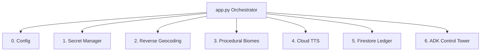

# Module 2: Enterprise Modular Architecture & TDD

In this module, we transition from a monolithic "script" to an enterprise-grade Service-Oriented Architecture (SOA). We will also adopt a **Test-Driven Development (TDD)** workflow to ensure our AI application is robust and "re-buildable."

## The "Essential 6" Stack

To scale this simulator, we've deconstructed the backend into six specialized services.




*As seen in the diagram above, our `app.py` acts as a central orchestrator. Instead of containing all the business logic, it delegates tasks to specialized modules. This prevents the "monolith" anti-pattern and makes it incredibly easy to swap out services (like changing our TTS provider or database) without breaking the entire application.*

Each service has a single responsibility and is isolated for maximum testability:

1.  **Service 0 (Config):** Environment detection and logging initialization.
2.  **Service 1 (Vault):** Zero-trust secret management (Secret Manager) with in-memory caching for performance (e.g., `get_maps_api_key`).
3.  **Service 2 (Geospatial):** Reverse geocoding utility using the Google Maps API.
4.  **Service 3 (AI Vision):** Multi-stage generative pipeline (Gemini + Imagen).
5.  **Service 4 (Audio):** Immersive Pilot voice synthesis (Text-to-Speech).
6.  **Service 5 (State Sync):** Shared Persistent World persistence (Firestore).

*(Note: To ensure we have enough time to focus on the core Generative AI and ADK features, **Service 1 (Vault)**, **Service 4 (Audio)**, and **Service 5 (State Sync)** have been pre-implemented for you in the starter code!)*

---

## The TDD Workflow (Red-Green-Refactor)

In cloud engineering, TDD is paramount. To ensure our backend services work without making expensive API calls during every test run, we use `pytest-mock` to simulate Google Cloud responses locally.

To speed up the workshop, we have already implemented **Service 1 (Vault)** for you as a reference. Let's verify it works!

**Action Marker 2.1:** Execute the test suite for the Vault Service. 

```bash
uv run pytest tests/test_vault.py
```

Because the `VaultService` is already implemented in `services/vault.py`, the terminal should indicate `3 passed` (the "Green" state). 

Feel free to open `services/vault.py` to see how we integrated an in-memory cache to minimize redundant network calls, and an environment variable fallback, perfectly satisfying our tests.

## Directory Blueprint

By the end of this refactor, your project structure will look like this:

```text
infinite-loop-simulator/
├── app.py                # The Orchestrator (< 50 lines)
├── config.py             # Service 0: GCP Configuration
├── services/             # The Service Core
│   ├── vault.py          # Service 1: Secret Management
│   ├── geospatial.py     # Service 2: Reverse Geocoding
│   └── ...               # (Services 3-5)
└── tests/                # The TDD Suite
```

This structure makes the application **"AI-Wirable"**—meaning each service can be independently tested and easily integrated into the main application via standardized interfaces.

---

## 🔌 The Orchestrator (`app.py`)
Before we can test our newly unlocked `VaultService`, our Flask backend needs routes that the frontend can call. In the starter code, `app.py` only has the basic `/` index route and a `[CODELAB ORCHESTRATION]` placeholder block at the bottom.

**Instructions:** Open `app.py` in your editor and locate the `[CODELAB ORCHESTRATION]` block near the bottom. We are going to paste **two separate endpoints** into this space.

### Step 1: The Locate Endpoint
First, paste the `/locate` endpoint. This route handles the "WHERE AM I?" button click from the frontend. Notice how it reverse geocodes the coordinates and delegates the airspace analysis to the Copilot Agent.

```python
@app.route("/locate", methods=["POST"])
def locate():
    """
    Reverse geocodes coordinates and hails the Copilot to contact the Control Tower.
    """
    try:
        data = request.json
        lat, lon = data.get("lat"), data.get("lon")

        # 1. Ground the AI: Convert coordinates into a real city name
        city_name = ReverseGeocode.get_location_name(lat, lon)

        # 2. Hailing the Copilot: Triggers the direct ADK Agent-to-Agent call
        atc_response = CopilotAgent.request_airspace_update(city_name)

        # 3. Text-to-Speech: Synthesize the transmission
        audio_b64 = AudioSynthesisService.synthesize_advisory(
            atc_response, voice_type="atc"
        )

        return jsonify({"audio": audio_b64, "text": atc_response, "city": city_name})
    except Exception as e:
        logger.error(f"Locate Error: {e}")
        return jsonify({"error": str(e)}), 500
```

### Step 2: The Terraform Endpoint
Next, immediately below the `/locate` route, paste the `/terraform` endpoint. This route is the heart of our simulator, chaining together 4 different cloud services sequentially to alter the physical world using the Procedural Biome Engine.

```python
@app.route("/terraform", methods=["POST"])
def terraform():
    """
    Uses the Procedural Biome Engine to generate a new world texture for the current city.
    """
    try:
        data = request.json
        lat, lon, prompt = (
            data.get("lat"),
            data.get("lon"),
            data.get("prompt", "Cyberpunk City"),
        )

        # 1. Reverse Geocode to identify the city biome
        city_name = ReverseGeocode.get_location_name(lat, lon)

        # 2. Procedural Biome Generation: Gemini designs it, Imagen paints it
        ai_result = AIVisionService.generate_biome_texture(city_name, prompt)

        # 3. Voice Briefing
        audio_b64 = AudioSynthesisService.synthesize_advisory(ai_result["advisory"])

        # 4. Persistence: Upload texture to CDN and log to standard event log
        texture_url = PersistentWorldClient.log_terraform_event(
            lat, lon, prompt, ai_result["image_b64"]
        )

        # 5. Calculate bounds for the frontend Cesium renderer
        offset = 0.0025
        bounds = [lat - offset, lon - offset, lat + offset, lon + offset]

        return jsonify(
            {
                "image": ai_result["image_b64"],
                "audio": audio_b64,
                "narrative": ai_result["advisory"],
                "texture_url": texture_url,
                "city": city_name,
                "bounds": bounds
            }
        )
    except Exception as e:
        logger.error(f"Terraforming Error: {e}")
        return jsonify({"error": str(e)}), 500
```

---

## 🚀 Your First Flight: Test the Simulator!

Now that you've implemented the Vault Service using the Gemini CLI, the backend can finally pull the Google Maps API Key and serve it to the frontend. Let's test it!

1. Start the Flask server in your Cloud Shell terminal:
   ```bash
   uv run app.py
   ```
2. Click the **Web Preview** button (the eye icon) in the top right of your Cloud Shell.
3. Select **Preview on port 8080**.

### 🗑️ Memory Eviction Built-In

Before we start building the AI features, note that the 3D map has built-in garbage collection logic. Our simulator only allows a maximum of 3 concurrent terraformed tiles. If you generate a 4th, the oldest tile is purged from memory and the 3D world to keep the browser running smoothly.


*The Web Preview feature securely tunnels port 8080 from your Cloud Shell virtual machine directly to your browser. If you don't see the CesiumJS globe, double-check that your `service-account-key.json` is in the root directory and that the Flask server output doesn't show any startup errors.*

You should now see the 3D globe load successfully! The AI terraforming features won't work yet, but you can fly around the world. Keep the server running and open a **new terminal tab** for the next modules.