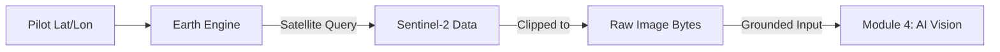

# Module 3: The Geospatial Engine (Grounded Vision)

To create a believable 3D world, we need to base our AI textures on real-world geography. In this module, we will implement **Service 2: The Geospatial Engine** to fetch high-resolution satellite imagery from **Google Earth Engine**.

## Grounding the AI
A major challenge with Generative AI is "hallucination." If we just ask an AI to "draw Tokyo," it might get the buildings right but the street layout wrong. By fetching a real satellite image first, we **ground** the AI, forcing it to repaint over the real physical footprint of the city.



## Why Earth Engine?
While standard map APIs provide tiles for navigation, **Google Earth Engine** provides programmatic access to petabytes of scientific satellite data (like Sentinel-2). This allows us to fetch the raw data we need to feed our generative AI "terraforming" pipeline.

## Implementation: The `EarthEngineClient`

We encapsulate the complex Earth Engine SDK logic into a clean `fetch_satellite_tile` method. This method performs three critical steps:

1.  **Authentication:** It seamlessly handles initialization via **Application Default Credentials (ADC)** or a local service account key.
2.  **Dataset Filtering:** It queries the `COPERNICUS/S2_SR_HARMONIZED` collection, filtering for the clearest (least cloudy) images from the past year.
3.  **Tile Extraction:** It clips the data to a specific 500m x 500m bounding box based on the pilot's current coordinates.

### The Service Logic (`services/geospatial.py`)

```python
@classmethod
def fetch_satellite_tile(cls, lat, lon, offset=0.0025):
    # Define the geographical bounding box
    region = ee.Geometry.Rectangle([lon - offset, lat - offset, lon + offset, lat + offset])
    
    # Filter for the clearest satellite image
    s2 = ee.ImageCollection("COPERNICUS/S2_SR_HARMONIZED")
    ee_image = s2.filterBounds(region).filterDate('2023-01-01', '2024-01-01') \
              .sort('CLOUDY_PIXEL_PERCENTAGE').first().clip(region)

    # Generate a download URL for the image
    original_img_url = ee_image.getThumbURL({'dimensions': 1024, 'region': region})
    
    # Download and return the raw bytes
    response = requests.get(original_img_url)
    return response.content, [lat - offset, lon - offset, lat + offset, lon + offset]
```

## AI Wiring Point

In our main `app.py`, we can now "wire up" the geospatial engine with a single line of code:

```python
# AI_WIRING_POINT: Geospatial Fetch
image_bytes, bounds = EarthEngineClient.fetch_satellite_tile(lat, lon)
```

By isolating this logic, we keep our main application logic focused purely on orchestration.
