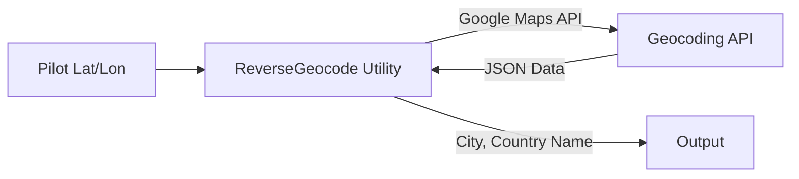

# Module 3: Telemetry & Reverse Geocoding

To create a believable 3D world, our generative AI needs to know *where* it is. In this module, we will implement **Reverse Geocoding** to convert the pilot's raw latitude and longitude coordinates into a human-readable city name.

## Grounding the AI

If a pilot asks to terraform the terrain into a "Cyberpunk City," the AI needs context. A Cyberpunk version of Paris should look different from a Cyberpunk version of Tokyo. By reverse-geocoding the coordinates, we provide this crucial "grounding" to the Gemini model.




---

## 🎯 Ticket #1: Reverse Geocoding Utility

Your task is to create a utility that leverages the Google Maps API to translate coordinates into city names.

### Step 1: Open `services/geospatial.py`
Navigate to `services/geospatial.py`. You will see the `ReverseGeocode` class with a `TODO: [TICKET 1]` marker.

### Step 2: Implement `ReverseGeocode`
Replace the `get_location_name` method with the following code. Notice how it securely fetches the Maps API key from the `VaultService` we configured earlier.

```python
    @staticmethod
    def get_location_name(lat: float, lon: float) -> str:
        """
        Calls Google Maps Reverse Geocoding API.
        Returns "City, Country" or "Unknown Location".
        """
        try:
            api_key = VaultService.get_maps_api_key()
            if not api_key:
                logger.warning("Geospatial: No Maps API Key found in Secret Manager.")
                return "Unknown Location"

            url = f"https://maps.googleapis.com/maps/api/geocode/json?latlng={lat},{lon}&key={api_key}"
            response = requests.get(url)
            response.raise_for_status()
            data = response.json()

            if data.get("status") == "OK" and data.get("results"):
                # Extract city and country from address_components
                components = data["results"][0].get("address_components", [])
                city = ""
                country = ""

                for component in components:
                    types = component.get("types", [])
                    if "locality" in types:
                        city = component.get("long_name", "")
                    elif "country" in types:
                        country = component.get("long_name", "")

                if city and country:
                    return f"{city}, {country}"
                elif country:
                    return country
            
            return "Unknown Location"
        except Exception as e:
            logger.error(f"Geospatial: Reverse Geocode Error: {e}")
            return "Unknown Location"
```

### Step 3: Test and Verify
While you can't test this in isolation yet, this foundational utility will be crucial for the next modules where we build the AI Biome Generator and the Copilot Agent!
