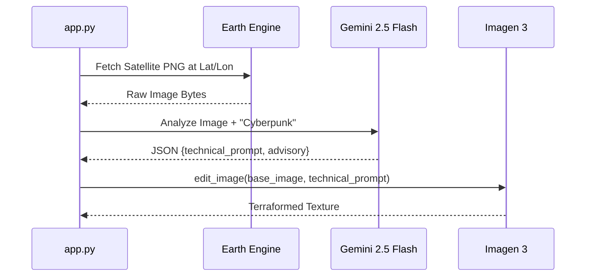

# Module 4: Multimodal AI Vision (Grounded Terraforming)

This is the most advanced part of the simulator's brain. In this module, we will build a **Visual RAG** pipeline. We don't just generate a random image; we use **Google Earth Engine** data to ground our generation in the real world.

## The 2-Stage Terraforming Loop

1.  **Stage 1: The Analyst (Gemini 2.5 Flash):** We send the raw satellite bytes to Gemini along with the pilot's prompt. Gemini analyzes the terrain and engineers a *technical* prompt for the image generator.
2.  **Stage 2: The Painter (Imagen 3):** We pass the technical prompt and the *original* image to Imagen 3. Using image-to-image translation, Imagen "repaints" the world while keeping every street and building footprint exactly where they are in reality.

---

## Architecture: Visual RAG Sequence
This diagram shows how we move from a 1D text prompt to a 2D geographically grounded texture.



---

## Implementation: `AIVisionService`

Open `services/ai_vision.py` and find **[CODELAB STEP 3B]**. You will use the Gemini CLI to implement the following:

```python
# [CODELAB STEP 3B]
# 1. Initialize gemini-2.5-flash
# 2. Create a 'Part' from the satellite bytes
# 3. Request strict JSON output matching our schema
```
