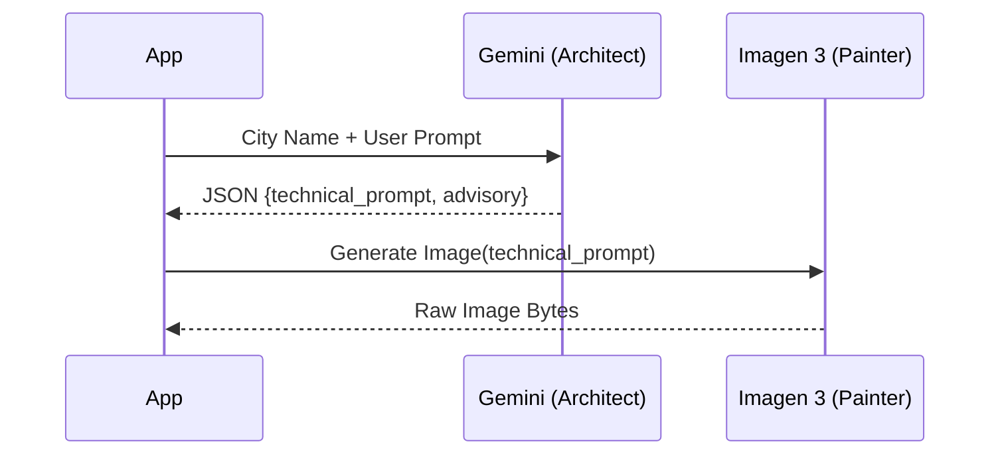

# Module 4: Generative Biomes (Procedural Architect)

The core imaginative engine of the simulator resides within the `AIVisionService`. In this module, we transition away from literal, constrained satellite imagery and embrace **Procedural Biome Generation**.

## The Biome Pipeline

Instead of asking AI to perform complex image-to-image alignment (which often results in distorted roads), we are using a two-model pipeline to generate stunning, thematic textures from scratch based purely on our location and prompt.

1.  **The Biome Architect (Gemini 2.5 Flash):** Gemini takes the real-world city name (e.g., "Paris") and the pilot's prompt (e.g., "Cyberpunk City") and generates a highly detailed, top-down technical prompt. It essentially "designs" the rules of the biome.
2.  **The Texture Painter (Imagen 3):** We pass Gemini's technical prompt into the Imagen 3 model. Imagen paints a beautiful, seamless tile representing the newly terraformed city.




This pipeline is honest, highly performant, and perfectly highlights the strengths of both Large Language Models and Diffusion Models.

---

## 🎯 Ticket #2: Procedural Biome Generation

Your task is to refactor the AI Vision service to utilize this new Architect/Painter pipeline.

### Step 1: Open `services/ai_vision.py`
Navigate to `services/ai_vision.py` and review the `BiomeDesign` schema. Notice how we use Pydantic to force Gemini to return structured JSON.

### Step 2: Implement the Architect and Painter
Replace the `generate_biome_texture` method with the following code. Notice how we first prompt `gemini-2.5-flash`, parse the structured output, and then feed that exact prompt into `imagen-3.0-generate-001`.

```python
    @staticmethod
    def generate_biome_texture(city_name: str, user_prompt: str) -> dict:
        """
        Uses Gemini to architect a biome and Imagen 3 to paint the texture.
        """
        try:
            client = genai.Client(
                vertexai=True,
                project=GCPConfig.PROJECT_ID,
                location=GCPConfig.LOCATION
            )

            # STEP 1: The Biome Architect (Gemini 2.5 Flash)
            architect_prompt = f"""
            You are a Biome Architect. Your goal is to design a procedural texture for the city of {city_name}.
            The pilot wants to transform the terrain into: '{user_prompt}'.
            
            1. Generate a technical prompt for Imagen 3. This prompt should describe a TOP-DOWN, 
               high-resolution satellite-style texture that looks like a seamless procedural map. 
               It should capture the 'vibe' of {user_prompt} while hinting at the layout of {city_name}.
            
            2. Provide a short, 1-sentence pilot advisory about entering this new biome.
            """

            logger.info(f"AI Vision: Architecting biome for {city_name}...")
            gemini_response = client.models.generate_content(
                model='gemini-2.5-flash',
                contents=architect_prompt,
                config=types.GenerateContentConfig(
                    response_mime_type="application/json",
                    response_schema=BiomeDesign,
                    temperature=0.7
                )
            )
            
            design = BiomeDesign.model_validate_json(gemini_response.text)

            # STEP 2: The Texture Painter (Imagen 3)
            logger.info(f"AI Vision: Painting texture: '{design.imagen_prompt[:50]}...'")
            imagen_response = client.models.generate_images(
                model='imagen-3.0-generate-001',
                prompt=design.imagen_prompt,
                config=types.GenerateImagesConfig(
                    number_of_images=1,
                    output_mime_type="image/png"
                )
            )
            
            final_image_bytes = imagen_response.generated_images[0].image_bytes
            image_b64 = base64.b64encode(final_image_bytes).decode('utf-8')

            return {
                "advisory": design.advisory,
                "image_b64": image_b64
            }
        except Exception as e:
            logger.error(f"AI Vision Error: {e}")
            raise e
```

### Step 3: Test and Verify
Restart your Flask server. Fly to a city, enter a prompt in the AI TERRAFORMER box, and click the launch button. You should hear the advisory, and see the map update with the procedurally generated Imagen texture!


