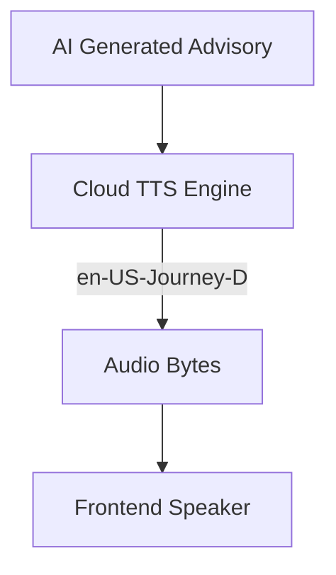

# Module 5: Immersive Audio (Text-to-Speech)

A flight simulator is not complete without an immersive audio experience. In this module, we will implement **Service 4: The Immersive Audio Engine** to turn Gemini's text advisories into a high-quality human voice.

## Multi-Voice Immersion
We are using **Cloud Text-to-Speech** to bring our AI entities to life. To differentiate between the Pilot and the Control Tower (ATC), our service accepts a `voice_type` parameter to select distinct voice models:

*   **The Pilot (`voice_type="pilot"`):** Uses `en-US-Studio-O` for natural briefings.
*   **The ATC (`voice_type="atc"`):** Uses `en-US-Journey-D` for an authoritative tone.




*This diagram highlights the routing of AI-generated text to the Cloud TTS Engine, which then returns base64-encoded audio directly to the browser.*

---

## Implementation: `AudioSynthesisService`

To keep us moving towards the final Agentic module, we have already fully implemented the `AudioSynthesisService` for you! 

**Action Marker 5.1:** Open `services/audio_engine.py` and review the code below. 

Notice how we configure the `texttospeech.AudioConfig` to return MP3 bytes directly, and how we encode the response to `base64`. This allows our `app.py` orchestrator to return the audio inside a JSON payload without ever needing to save a temporary MP3 file to disk!

```python
import base64
from google.cloud import texttospeech

class AudioSynthesisService:

    @staticmethod
    def synthesize_advisory(text: str, voice_type: str = "pilot") -> str:
        # Instantiate the Google Cloud Text-to-Speech client
        client = texttospeech.TextToSpeechClient()
        
        # Configure the voice based on the requested persona
        voice_name = "en-US-Journey-D" if voice_type == "atc" else "en-US-Studio-O"
        voice = texttospeech.VoiceSelectionParams(
            language_code="en-US", 
            name=voice_name
        )
        
        # Request MP3 format. A speaking_rate of 1.05 provides a professional cadence.
        audio_config = texttospeech.AudioConfig(
            audio_encoding=texttospeech.AudioEncoding.MP3,
            speaking_rate=1.05
        )
        
        response = client.synthesize_speech(
            input=texttospeech.SynthesisInput(text=text), 
            voice=voice, 
            audio_config=audio_config
        )
        
        # Return base64 encoded bytes
        return base64.b64encode(response.audio_content).decode('utf-8')
```

Your app is now fully wired for sound. Keep your server running and proceed to the final module!
