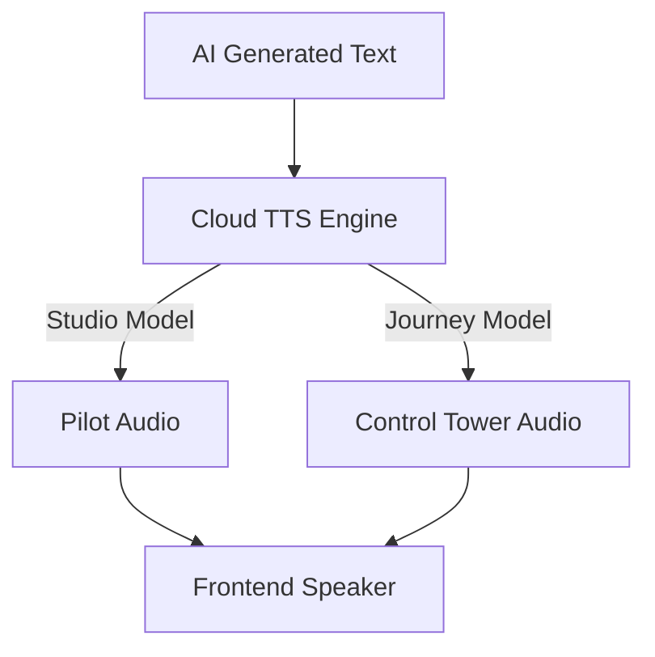

# Module 5: Immersive Audio (Text-to-Speech)

A flight simulator is not complete without an immersive audio experience. In this module, we will implement **Service 4: The Immersive Audio Engine** to turn Gemini's text advisories into a high-quality human voice.

## Multi-Voice Immersion
We are using **Cloud Text-to-Speech** to bring our AI entities to life. To differentiate between the Pilot and the Control Tower, we use two distinct, high-fidelity voice models:

*   **The Pilot (Studio):** Uses `en-US-Studio-O` for extremely natural, smooth briefings.
*   **The ATC (Journey):** Uses `en-US-Journey-D` for an authoritative, "command-center" tone.



## Implementation: `AudioSynthesisService`

We encapsulate the TTS logic into a single `synthesize_advisory` method. 

1.  **Request:** It sends the text to the Google Cloud TTS API.
2.  **Configuration:** It requests the specific Studio voice and MP3 encoding.
3.  **Transmission:** It returns the audio data as a **Base64 encoded string**. This allows the frontend to play the audio instantly using the standard Web Audio API without needing to manage temporary files or additional requests.

### The Service Logic (`services/audio_engine.py`)

```python
@staticmethod
def synthesize_advisory(text):
    client = texttospeech.TextToSpeechClient()
    
    # Configure the Studio-level voice
    voice = texttospeech.VoiceSelectionParams(
        language_code="en-US", 
        name="en-US-Studio-O"
    )
    
    # Request MP3 format
    audio_config = texttospeech.AudioConfig(
        audio_encoding=texttospeech.AudioEncoding.MP3
    )
    
    response = client.synthesize_speech(
        input=texttospeech.SynthesisInput(text=text), 
        voice=voice, 
        audio_config=audio_config
    )
    
    # Return encoded bytes
    return base64.b64encode(response.audio_content).decode('utf-8')
```

## AI Wiring Point

In our main `app.py`, we wire up the audio engine immediately after the AI Vision analysis:

```python
# AI_WIRING_POINT: Immersive Audio Synthesis
audio_b64 = AudioSynthesisService.synthesize_advisory(ai_result['advisory'])
```

Now, every time the world is terraformed, the pilot will hear a real-time vocal briefing!
