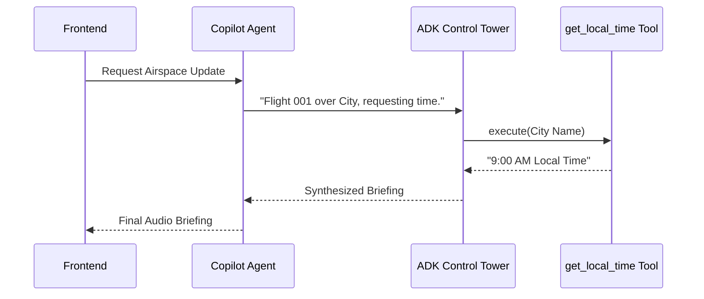

# Module 6: Agentic Intelligence (Google ADK)

In this final module, we move beyond simple LLM prompts and build **Autonomous Agents** using the **Google Agent Development Kit (ADK)**. 

## The Copilot and The Control Tower

We are going to implement an **Agent-to-Agent (A2A)** workflow:
1.  **The Copilot Agent:** A standard Python class that handles requests from the human pilot in the cockpit.
2.  **The Control Tower Agent:** An autonomous AI built with the Google ADK. It has access to external **Tools** (Python functions) that it can decide to execute on its own to gather information before responding to the Copilot.

To keep things simple, we will give the Control Tower a single tool: the ability to look up the local time for a specific city. 




---

## 🎯 Tickets #3 & #4: The ADK Agents

Your task is to implement both agents and wire them together.

### Step 1: Open `services/control_tower.py`
Navigate to `services/control_tower.py`.

### Step 2: Implement the ADK Control Tower
Copy the following code. Pay close attention to how `get_local_time` is passed into the `Agent` as a tool, and how the `Runner` handles the session memory.

```python
from google.genai import types
from google.adk import Agent, Runner
from google.adk.sessions import InMemorySessionService
from config import logger

def get_local_time(city_name: str) -> str:
    """Fetches the current local time for the specified city."""
    logger.info(f"Tool Execution: Fetching simulated time for {city_name}...")
    return "9:00 AM Local Time"

# 1. Initialize ADK Agent with Tool
control_tower_agent = Agent(
    name="ControlTower",
    model="gemini-2.5-flash",
    instruction=(
        "You are the Global Control Tower AI. "
        "When a Copilot contacts you with their location, ALWAYS use the 'get_local_time' "
        "tool to find their local time. "
        "Respond concisely with the local time and one interesting factoid about their city. "
        "Keep the response under 3 sentences."
    ),
    tools=[get_local_time]
)

# 2. Initialize ADK Runner with Memory
session_service = InMemorySessionService()
tower_runner = Runner(
    agent=control_tower_agent, 
    app_name="infinite_flight", 
    session_service=session_service, 
    auto_create_session=True
)
```

### Step 3: Implement the Copilot
Below the Control Tower code, add the `CopilotAgent`. This agent acts on behalf of the user to trigger the Control Tower's ADK Runner.

```python
class CopilotAgent:
    """
    Cockpit AI Agent that interacts with the human pilot.
    Orchestrates the A2A call directly to the Control Tower ADK Runner.
    """
    @staticmethod
    def request_airspace_update(city_name: str) -> str:
        """
        Directly invokes the Control Tower ADK agent and returns the briefing.
        """
        try:
            logger.info(f"Copilot Agent: Hailing Control Tower for {city_name}...")
            
            request_content = f"Control Tower, this is Flight 001 Copilot over {city_name}. Requesting time and local factoid."
            
            # 3. Execute ADK Runner Loop directly (Simple A2A)
            events = tower_runner.run(
                user_id="pilot_1",
                session_id="flight_001_session",
                new_message=types.Content(
                    role="user", 
                    parts=[types.Part.from_text(text=request_content)]
                )
            )

            final_text = ""
            for event in events:
                if getattr(event, 'error_message', None):
                    logger.error(f"ADK Event Error: {event.error_message}")
                if event.content and event.content.parts:
                    for part in event.content.parts:
                        if part.text:
                            final_text += part.text

            final_text = final_text.strip()
            if not final_text:
                logger.warning(f"Copilot Agent: Received empty transmission. Using fallback.")
                return f"Captain, I'm getting static from the Control Tower over {city_name}. Standby."

            logger.info(f"Copilot Agent: Received transmission: {final_text}")
            return final_text

        except Exception as e:
            logger.error(f"Copilot Agent Error: {e}")
            return f"Captain, we are unable to reach the Control Tower. Standard clear conditions assumed for {city_name}."
```

### Step 4: Test and Verify
Restart your Flask server. Fly to a new city, open your Comms Radio, and click **WHERE AM I?**. Watch your terminal logs. You will see the ADK autonomously decide to execute the `get_local_time` tool, read the result, and stream a completely unique, location-aware voice briefing back to your cockpit!
