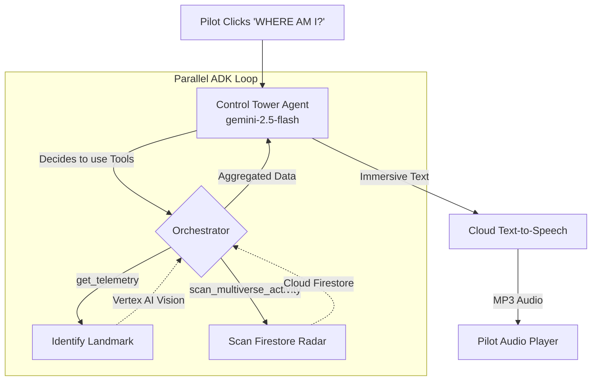

# Module 6: Agentic Intelligence & The Multiverse Radar

In this final module, we move beyond simple APIs and build a true **Autonomous Agent** alongside a **Multiverse State Sync** service to share terraforming events globally.

## The Global Multiverse Client
Before we build the agent, we need a way to store and retrieve global events. The `GlobalMultiverseClient` handles this using two Cloud services:
1.  **Cloud Storage (Texture CDN):** When a user terraforms an area, the generated image is uploaded to a public Cloud Storage bucket. This acts as a global CDN for our textures.
2.  **Cloud Firestore (Metadata & Radar):** We store the metadata (latitude, longitude, prompt, and the public CDN URL) in Firestore. This creates a real-time database of all anomalies across the multiverse.

## Why an Agent?
Instead of hardcoding what the "WHERE AM I?" button does, we give Gemini 2.5 Flash access to **Tools** via Vertex AI Function Calling (ADK). The `ControlTowerAgent` will autonomously decide to:
1.  **Visually identify** the landmark below the pilot using the `get_telemetry` tool.
2.  **Scan the Firestore database** using the `scan_multiverse_activity` tool to find recent terraforming "anomalies" created by other pilots globally.

The Agent executes these tools in **parallel**, reads the data, and synthesizes a single, immersive audio advisory.

---

## Architecture: Parallel ADK Loop
This diagram shows how the Agent orchestrates other Cloud services as tools.

---

## Implementation: `ControlTowerAgent`

Open `services/control_tower.py` and find **[CODELAB STEP 6]**. You will build an Agent that:
*   Defines `get_telemetry` and `scan_multiverse_activity` as `FunctionDeclaration` objects.
*   Passes these to the `GenerativeModel` as a `Tool`.
*   Uses `agent.start_chat()` to begin an agentic session.
*   Handles the `function_calls` loop to execute the logic in `ai_vision.py` and `state_sync.py`.

---

## Mission Accomplished! 🚀

You have successfully built an enterprise-grade **Service-Oriented Architecture** using the **Essential 6 Google Cloud Stack**. 

By mastering **Visual RAG**, **Function Calling**, and **Global State Sync**, you've proven that you can build AI systems that are grounded in reality and autonomous in action. 

**Capturing the Money Shot:**
1.  Terraform an area into "Mars Colony".
2.  Fly to a different city.
3.  Click "WHERE AM I?" and listen as your Agentic Control Tower warns you about the anomaly you just created in the multiverse.