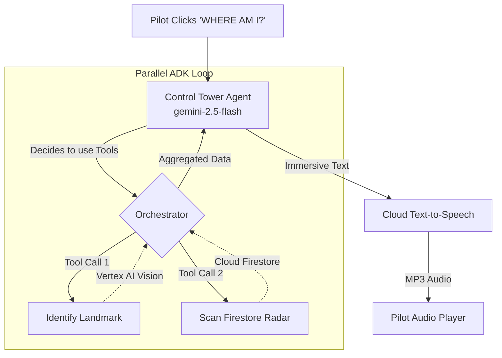

# Module 6: Agentic Intelligence & The Multiverse Radar

In this final module, we move beyond simple APIs and build a true **Autonomous Agent**. We will implement the **Control Tower Agent** using Vertex AI Function Calling (ADK).

## Why an Agent?
Instead of hardcoding what the "WHERE AM I?" button does, we give Gemini 2.5 Flash access to **Tools**. The Agent will autonomously decide to:
1.  **Visually identify** the landmark below the pilot.
2.  **Scan the Firestore database** to find recent terraforming "anomalies" created by other pilots globally.

The Agent executes these tools in **parallel**, reads the data, and synthesizes a single, immersive audio advisory.

---

## Architecture: Parallel ADK Loop
This diagram shows how the Agent orchestrates other Cloud services as tools.

---

## Implementation: `ControlTowerAgent`

Open `services/control_tower.py` and find **[CODELAB STEP 6]**. You will build an Agent that:
*   Defines `get_telemetry` and `scan_multiverse_activity` as function declarations.
*   Uses `agent.start_chat()` to begin an agentic session.
*   Handles the `function_calls` loop to execute the logic in `ai_vision.py` and `state_sync.py`.

---

## Mission Accomplished! 🚀

You have successfully built an enterprise-grade **Service-Oriented Architecture** using the **Essential 6 Google Cloud Stack**. 

By mastering **Visual RAG** and **Parallel ADK**, you've proven that you can build AI systems that are grounded in reality and autonomous in action. 

**Capturing the Money Shot:**
1.  Terraform an area into "Mars Colony".
2.  Fly to a different city.
3.  Click "WHERE AM I?" and listen as your Agentic Control Tower warns you about the anomaly you just created in the multiverse.
