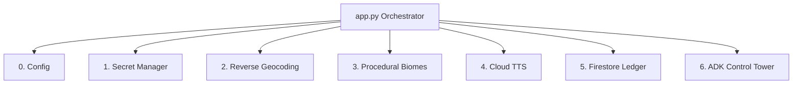

summary: Build a 3D AI-powered Flight Simulator using the Essential 6 Google Cloud Stack (Gemini, Imagen, ADK, and more).
id: infinite-flight-simulator
categories: AI, Cloud, Python
environments: Web
status: Published
feedback link: https://github.com/jorgeajimenez/infinite-loop-simulator/issues
authors: Open Source Engineering

# Build an AI-Powered 3D Flight Simulator

## Introduction
Duration: 02:00

Welcome to the AI-Powered 3D Flight Simulator build! 

### 🛩️ The Mission
Today, you are stepping into the shoes of an AI Systems Engineer. We have a fully functional front-end 3D flight simulator built on CesiumJS, but it's currently a **ghost world**: 
*   The globe is silent and static.
*   The 3D terrain is generic satellite imagery.
*   The cockpit instruments have no "brain" to understand where they are.

**Your mission is to bring this simulator to life.** You will rip out the mocked data and wire it up to a live, production-grade **Google Cloud AI Backend**.

### 🧠 What You'll Learn
*   **Grounded AI:** How to use **Google Maps Platform** to ground your models in real-world location data.
*   **Generative Multimodality:** How to orchestrate **Gemini 2.5 Flash** as an Architect and **Imagen 3** as a Painter to procedurally generate new worlds.
*   **Immersive Audio:** How to use **Cloud Text-to-Speech** to give your AI a voice.
*   **Autonomous Agents:** How to build agentic workflows using the **Google Agent Development Kit (ADK)**.

### 🛠️ What You'll Build
A multimodal backend that transforms a silent 3D globe into an interactive simulation where you can terraform cities with a text prompt and receive autonomous voice briefings from an AI Control Tower.


## Environment Setup
Duration: 10:00

Before building the simulator's brain, we need to ensure your environment is correctly wired to Google Cloud.

### Step 1: Account Preparation & Billing
1.  **Billing Account:** You must have an active billing account. Go to the [Google Cloud Billing Console](https://console.cloud.google.com/billing) and ensure a billing account is linked to your current project.
2.  **Activate Cloud Shell:** Click the `>_` terminal icon in the top right of your Google Cloud Console. This is your primary development environment.

### Step 2: Clone & Synchronize
Google Cloud Shell comes pre-configured with most tools, but we will use `uv` for ultra-fast dependency management.

**Action:** Open your Cloud Shell terminal and run:

```bash
curl -LsSf https://astral.sh/uv/install.sh | sh
source $HOME/.local/bin/env
git clone https://github.com/jorgeajimenez/ai-flight-simulator.git
cd ai-flight-simulator
uv sync
```

### Step 3: Enable Google Cloud APIs
Run our automated setup script to enable the "Essential 6" APIs:

```bash
chmod +x scripts/setup_gcp.sh
./scripts/setup_gcp.sh
```

Positive
: This script enables Secret Manager, Vertex AI, Text-to-Speech, Firestore, and Maps APIs. It will also help you create a Service Account key.

Negative
: **Quota Warning:** If you are using a new project, ensure you have enabled billing. Imagen 3 and Gemini 2.5 Flash require an active billing account even within the free tier.

## Module 2: Software Engineering & Work Specification
Duration: 05:00

This is not a traditional tutorial where you copy and paste 500 lines of code into a single monolithic script. We are building an enterprise-grade AI application, which means we must apply rigorous **Software Engineering** principles.

### 🏗️ Why Service-Oriented Architecture (SOA)?
By defining our specifications clearly, we can deconstruct the backend into specialized services (Geospatial, AI Vision, Audio, etc.). This prevents the "monolith" anti-pattern. Because each service has a strict specification, it is incredibly easy to swap out models—for example, safely upgrading an agent from Gemini 1.5 to Gemini 2.5—without breaking the rest of the flight simulator.




### 🎫 The Ticket-Driven Workflow
To simulate a real-world engineering team, we use a **Ticket-Driven Workflow** guided by a work specification document.

1.  **Read the Spec:** Open `tickets.csv` in your editor. This acts as your Product Manager's work specification. It outlines exactly what feature needs to be built and its expected behavior.
2.  **Locate the TODO:** Find the corresponding `# TODO: [TICKET X]` marker in the `services/` directory.
3.  **Implement & Verify:** Write the logic using Google Cloud SDKs to fulfill the exact contract of the spec, and then test it.

## Module 3: Telemetry & Reverse Geocoding
Duration: 10:00

In this module, we implement **Service 1: The Geospatial Engine**. Currently, the pilot is flying blindly. We need to "ground" our AI by giving it real city names based on the flight's telemetry.

### 🎯 Ticket #1: Implement Reverse Geocoding
We need to use the **Google Maps Geocoding API** to convert raw latitude and longitude into a human-readable city name.

### Implementation
1.  Open `services/geospatial.py`.
2.  Find the `ReverseGeocode` class and the `TODO: [TICKET 1]` marker.
3.  Implement the `get_location_name` method:

```python
    @staticmethod
    def get_location_name(lat: float, lon: float) -> str:
        """
        Calls Google Maps Reverse Geocoding API.
        Returns "City, Country" or "Unknown Location".
        """
        try:
            api_key = VaultService.get_maps_api_key()
            if not api_key:
                logger.warning("Geospatial: No Maps API Key found in Secret Manager.")
                return "Unknown Location"

            url = f"https://maps.googleapis.com/maps/api/geocode/json?latlng={lat},{lon}&key={api_key}"
            response = requests.get(url)
            response.raise_for_status()
            data = response.json()

            if data.get("status") == "OK" and data.get("results"):
                # Extract city and country from address_components
                components = data["results"][0].get("address_components", [])
                city = ""
                country = ""

                for component in components:
                    types = component.get("types", [])
                    if "locality" in types:
                        city = component.get("long_name", "")
                    elif "country" in types:
                        country = component.get("long_name", "")

                if city and country:
                    return f"{city}, {country}"
                elif country:
                    return country
            
            return "Unknown Location"
        except Exception as e:
            logger.error(f"Geospatial: Reverse Geocode Error: {e}")
            return "Unknown Location"
```

### 🔍 Verify the Grounding
Start your server:
```bash
uv run python app.py
```
Fly over a city and check the cockpit telemetry in the browser.
**Look at your terminal for:** `AI Vision: Architecting biome for [City Name]...`
If you see a real city name instead of "Unknown Airspace", your AI is now grounded!

## Module 4: Generative Biomes (Gemini + Imagen)
Duration: 15:00

Now that we know *where* we are, let's change what the world looks like. We will use a **Multi-Model Orchestration** pipeline.

### 🎨 The "Why" of Orchestration
Why not just ask Imagen to "Paint Paris in Cyberpunk"? Because Imagen is a painter, not a geographer. 
By using **Gemini 2.5 Flash as an Architect**, we first generate a high-detail, top-down technical prompt that describes the *rules* of the biome. We then pass that technical "blueprint" to **Imagen 3 (The Painter)**. This ensures the generated texture feels consistent with the location.

### 🎯 Ticket #2: Procedural Biome Generation
Open `services/ai_vision.py` and implement the `generate_biome_texture` method.

```python
    @staticmethod
    def generate_biome_texture(city_name: str, user_prompt: str) -> dict:
        """
        Uses Gemini to architect a biome and Imagen 3 to paint the texture.
        """
        try:
            client = genai.Client(
                vertexai=True,
                project=GCPConfig.PROJECT_ID,
                location=GCPConfig.LOCATION
            )

            # STEP 1: The Biome Architect (Gemini 2.5 Flash)
            architect_prompt = f"""
            You are a Biome Architect. Your goal is to design a procedural texture for the city of {city_name}.
            The pilot wants to transform the terrain into: '{user_prompt}'.
            
            1. Generate a technical prompt for Imagen 3. This prompt should describe a TOP-DOWN, 
               high-resolution satellite-style texture that looks like a seamless procedural map. 
               It should capture the 'vibe' of {user_prompt} while hinting at the layout of {city_name}.
            
            2. Provide a short, 1-sentence pilot advisory about entering this new biome.
            """

            logger.info(f"AI Vision: Architecting biome for {city_name}...")
            gemini_response = client.models.generate_content(
                model='gemini-2.5-flash',
                contents=architect_prompt,
                config=types.GenerateContentConfig(
                    response_mime_type="application/json",
                    response_schema=BiomeDesign,
                    temperature=0.7
                )
            )
            
            design = BiomeDesign.model_validate_json(gemini_response.text)

            # STEP 2: The Texture Painter (Imagen 3)
            logger.info(f"AI Vision: Painting texture: '{design.imagen_prompt[:50]}...'")
            imagen_response = client.models.generate_images(
                model='imagen-3.0-generate-001',
                prompt=design.imagen_prompt,
                config=types.GenerateImagesConfig(
                    number_of_images=1,
                    output_mime_type="image/png"
                )
            )
            
            final_image_bytes = imagen_response.generated_images[0].image_bytes
            image_b64 = base64.b64encode(final_image_bytes).decode('utf-8')

            return {
                "advisory": design.advisory,
                "image_b64": image_b64
            }
        except Exception as e:
            logger.error(f"AI Vision Error: {e}")
            raise e
```

### 🔍 Verify the Terraform
Type "Cyberpunk City" into the AI TERRAFORMER box in the browser.
**Watch your terminal:** You should see Gemini generating the JSON design, followed by Imagen painting the pixels. The map will update with a unique, procedurally generated tile!

## Module 5: Immersive Audio
Duration: 05:00

A flight simulator is not complete without an immersive audio experience. We use **Cloud Text-to-Speech** to bring our AI entities to life.

### Multi-Voice Personas
We've pre-implemented this in `services/audio_engine.py` using two distinct voice models:
*   **The Pilot:** Uses `en-US-Studio-O` for natural-sounding briefings.
*   **The ATC:** Uses `en-US-Journey-D` for an authoritative, radio-style tone.

Positive
: Note how we encode the audio as `base64`. This allows us to stream audio directly to the frontend without saving temporary MP3 files to disk.

```python
    @staticmethod
    def synthesize_advisory(text: str, voice_type: str = "pilot") -> str:
        # Instantiate the Google Cloud Text-to-Speech client
        client = texttospeech.TextToSpeechClient()
        
        # Configure the voice based on the requested persona
        voice_name = "en-US-Journey-D" if voice_type == "atc" else "en-US-Studio-O"
        voice = texttospeech.VoiceSelectionParams(
            language_code="en-US", 
            name=voice_name
        )
        
        # Request MP3 format.
        audio_config = texttospeech.AudioConfig(
            audio_encoding=texttospeech.AudioEncoding.MP3,
            speaking_rate=1.05
        )
        
        response = client.synthesize_speech(
            input=texttospeech.SynthesisInput(text=text), 
            voice=voice, 
            audio_config=audio_config
        )
        
        return base64.b64encode(response.audio_content).decode('utf-8')
```

## Module 6: Agentic Intelligence (Google ADK)
Duration: 20:00

In this final module, we move beyond simple prompts and build **Autonomous Agents** using the **Google Agent Development Kit (ADK)**.

### 🤖 Why use the ADK?
The ADK allows our AI to become an **Agent** that can:
1.  **Use Tools:** Automatically decide to call Python functions to get real-time data.
2.  **Manage Memory:** Keep track of the conversation history.
3.  **Orchestrate Workflows:** Decide *how* to solve a problem rather than just predicting the next word.

### 🎯 Tickets #3 & #4: The ADK Agents
Open `services/control_tower.py`. You will implement a **Control Tower Agent** that has access to a `get_local_time` tool.

### Implementation
```python
from google.genai import types
from google.adk import Agent, Runner
from google.adk.sessions import InMemorySessionService

def get_local_time(city_name: str) -> str:
    """Fetches the current local time for the specified city."""
    return "9:00 AM Local Time"

# 1. Initialize ADK Agent with Tool
control_tower_agent = Agent(
    name="ControlTower",
    model="gemini-2.5-flash",
    instruction="You are the Global Control Tower AI. Respond with the local time.",
    tools=[get_local_time]
)

# 2. Initialize ADK Runner
session_service = InMemorySessionService()
tower_runner = Runner(agent=control_tower_agent, session_service=session_service)

# 3. Implement the Copilot to trigger the ADK Runner
class CopilotAgent:
    @staticmethod
    def request_airspace_update(city_name: str) -> str:
        events = tower_runner.run(
            new_message=types.Content(
                role="user", 
                parts=[types.Part.from_text(text=f"Requesting update for {city_name}")]
            )
        )
        return "".join([p.text for e in events if e.content for p in e.content.parts if p.text])
```

### 🔍 Verify the Agent
Click **WHERE AM I?** in the simulator.
**Look at your terminal for:** `Tool Execution: Fetching simulated time for...`
This is the "Aha!" moment. You didn't tell Gemini to call the function; the **ADK Agent** realized it needed the time to fulfill your request and called the tool autonomously!

## Conclusion & Next Steps
Duration: 02:00

Congratulations! You have successfully built an enterprise-grade **Service-Oriented Architecture** using the **Essential 6 Google Cloud Stack**.

### What you've achieved:
1.  **Grounded AI** with real-world Maps telemetry.
2.  **Generative Multimodality** by orchestrating Gemini and Imagen.
3.  **Autonomous Agents** using the Google ADK.

### Next Steps:
*   **Scale up:** Add more tools to the Control Tower (e.g., real weather APIs).
*   **Customize:** Change the Imagen prompts in `ai_vision.py` to create "Mars Colony" or "Underwater" biomes.
*   **Deploy:** Explore **Firebase Hosting** to share your simulator with the world.

🏆 **Mission Accomplished!**
