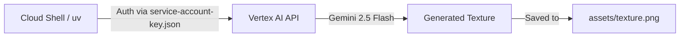
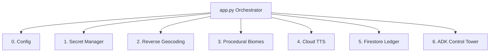
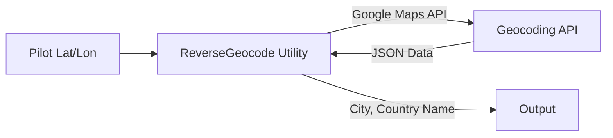
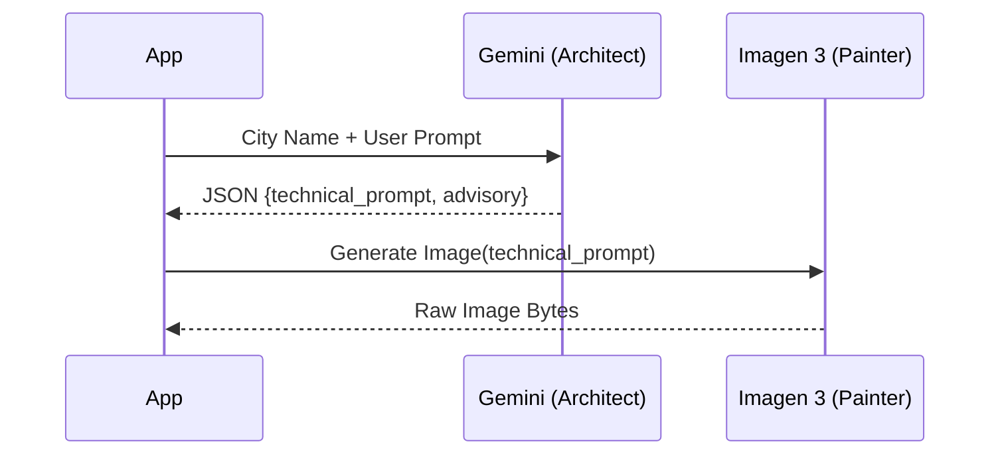
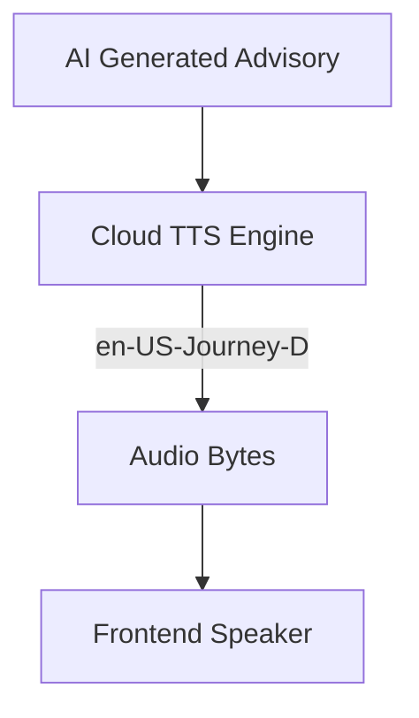
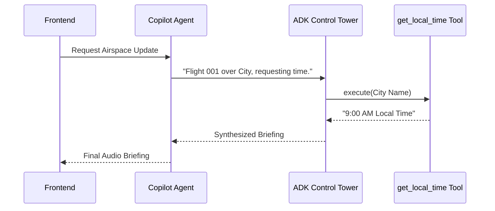

# Module 0: Welcome to Infinite Flight

Welcome to the **"Build with AI"** 3D Flight Simulator workshop! We are thrilled to have you here.

## 🛩️ The Mission

Today, you are stepping into the shoes of an AI Systems Engineer. We have a fully functional front-end 3D flight simulator built on CesiumJS. Your mission is to rip out its mocked backend data and wire it up to a live, production-grade **Google Cloud AI Backend**.

### 🧠 The Curriculum
The codelab is broken down into 6 distinct modules:
*   **Module 1: Cloud Setup** - Provisioning your Google Cloud project and enabling required APIs.
*   **Module 2: Modular Architecture** - Understanding the Service-Oriented Architecture (SOA) and the ticketing workflow.
*   **Module 3: Telemetry & Reverse Geocoding** - Implementing the Google Maps API to ground the AI with real-world city names.
*   **Module 4: Generative Biomes** - Using Gemini 2.5 Flash as an Architect and Imagen 3 as a Painter to procedurally generate immersive new worlds.
*   **Module 5: Immersive Audio** - Converting the AI's pilot advisories into high-quality human speech using Cloud TTS.
*   **Module 6: Agentic Intelligence** - Building autonomous AI Agents using the Google Agent Development Kit (ADK) that can actively call external tools.

## 🛠️ How this Workshop works

This is not a traditional tutorial where you copy and paste 500 lines of code into a single file. 

We will be using a **Ticket-Driven Workflow**, just like a real engineering team. You will look at your assigned tickets (e.g., `tickets_v2.csv`), open the corresponding Python service, implement the missing logic using the Google Cloud SDKs, and verify your changes.

Let's start by getting your Google Cloud environment ready!


# Module 1: Cloud Setup & Initial Generation

Before building the flight simulator's brain, we need to ensure your environment is correctly wired to Google Cloud. If you are using a brand new Google account, follow these steps exactly.

## Step 1: Account Preparation & Billing

1.  **Billing Account:** You must have an active billing account. Go to the [Google Cloud Billing Console](https://console.cloud.google.com/billing) and ensure a billing account is linked to your current project.
2.  **Activate Cloud Shell:** Click the `>_` terminal icon in the top right of your Google Cloud Console. This is your primary development environment.

## Step 2: Clone & Synchronize

Google Cloud Shell comes pre-configured with most tools you need, but we will use the ultra-fast `uv` Python package manager to handle our dependencies smoothly.

**Action Marker 1.1:** Open your Cloud Shell terminal, install `uv`, clone the project, and synchronize the dependencies.

```bash
curl -LsSf https://astral.sh/uv/install.sh | sh
source $HOME/.local/bin/env
git clone https://github.com/jorgeajimenez/ai-flight-simulator.git
cd ai-flight-simulator
uv sync
```

## Step 3: Identity & Access Management (IAM)

We've provided a script to automate the creation of your Google Cloud Project, enable APIs (Vertex AI, Geocoding, Secret Manager, TTS), and configure your Service Account. 

**Action Marker 1.2:** Run the setup script in your terminal. 

```bash
bash scripts/setup_gcp.sh
```

**Pause for the Maps API Key:**
During execution, the script will automatically pause and present you with two highly visible, clickable links.

1. *While the script is paused*, hold `CTRL` (or `CMD` on Mac) and click the **STEP 1** link. This will open the Map Tiles API page for your specific project. Click the blue **ENABLE** button.


2. Next, hold `CTRL` (or `CMD` on Mac) and click the **STEP 2** link to open the Credentials page. Click **Create Credentials** -> **API Key** and copy it.


3. Go back to your Cloud Shell terminal, paste the key, and press Enter. The script will securely lock it inside Google Cloud Secret Manager.

## Step 4: Verification (The Vertex AI Handshake)

Let's verify that the AI is working before touching the code. We will use **Gemini 2.5 Flash** to generate a custom 3D building texture.

**Action Marker 1.3:** Execute the texture verification script.

```bash
uv run python scripts/generate_texture.py "Cyberpunk hacker apartment block..."
```

**Verification:** If you see `Saved texture to assets/texture.svg`, your cloud environment is structurally sound.

---

## Architecture: The Cloud Handshake

> 💡 **A Note on Mermaid Diagrams (Docs as Code)**
> Throughout this codelab, you will see `mermaid` code blocks followed by an image of a diagram. [Mermaid](https://mermaid.js.org/) is a popular open-source tool that allows engineers to generate architectural flowcharts using simple, readable text. We have intentionally included both the raw Mermaid code and the final rendered image as a pedagogical tool, so you can learn how to easily document your own AI architectures!

The diagram below shows how your Cloud Shell environment is communicating with Vertex AI using the credentials we just generated.




*Notice how `uv` authenticates via the `service-account-key.json` file we generated in the setup script. This establishes a secure, zero-trust handshake with the Vertex AI API, allowing Gemini 2.5 Flash to generate our initial SVG texture and save it locally to the assets folder. This fundamental auth flow will power the rest of our AI services.*


# Module 2: Enterprise Modular Architecture & TDD

In this module, we transition from a monolithic "script" to an enterprise-grade Service-Oriented Architecture (SOA). We will also adopt a **Test-Driven Development (TDD)** workflow to ensure our AI application is robust and "re-buildable."

## The "Essential 6" Stack

To scale this simulator, we've deconstructed the backend into six specialized services.




*As seen in the diagram above, our `app.py` acts as a central orchestrator. Instead of containing all the business logic, it delegates tasks to specialized modules. This prevents the "monolith" anti-pattern and makes it incredibly easy to swap out services (like changing our TTS provider or database) without breaking the entire application.*

Each service has a single responsibility and is isolated for maximum testability:

1.  **Service 0 (Config):** Environment detection and logging initialization.
2.  **Service 1 (Vault):** Zero-trust secret management (Secret Manager) with in-memory caching for performance (e.g., `get_maps_api_key`).
3.  **Service 2 (Geospatial):** Reverse geocoding utility using the Google Maps API.
4.  **Service 3 (AI Vision):** Multi-stage generative pipeline (Gemini + Imagen).
5.  **Service 4 (Audio):** Immersive Pilot voice synthesis (Text-to-Speech).
6.  **Service 5 (State Sync):** Shared Persistent World persistence (Firestore).

*(Note: To ensure we have enough time to focus on the core Generative AI and ADK features, **Service 1 (Vault)**, **Service 4 (Audio)**, and **Service 5 (State Sync)** have been pre-implemented for you in the starter code!)*

---

## The TDD Workflow (Red-Green-Refactor)

In cloud engineering, TDD is paramount. To ensure our backend services work without making expensive API calls during every test run, we use `pytest-mock` to simulate Google Cloud responses locally.

To speed up the workshop, we have already implemented **Service 1 (Vault)** for you as a reference. Let's verify it works!

**Action Marker 2.1:** Execute the test suite for the Vault Service. 

```bash
uv run pytest tests/test_vault.py
```

Because the `VaultService` is already implemented in `services/vault.py`, the terminal should indicate `3 passed` (the "Green" state). 

Feel free to open `services/vault.py` to see how we integrated an in-memory cache to minimize redundant network calls, and an environment variable fallback, perfectly satisfying our tests.

## Directory Blueprint

By the end of this refactor, your project structure will look like this:

```text
infinite-loop-simulator/
├── app.py                # The Orchestrator (< 50 lines)
├── config.py             # Service 0: GCP Configuration
├── services/             # The Service Core
│   ├── vault.py          # Service 1: Secret Management
│   ├── geospatial.py     # Service 2: Reverse Geocoding
│   └── ...               # (Services 3-5)
└── tests/                # The TDD Suite
```

This structure makes the application **"AI-Wirable"**—meaning each service can be independently tested and easily integrated into the main application via standardized interfaces.

---

## 🔌 The Orchestrator (`app.py`)
Before we can test our newly unlocked `VaultService`, our Flask backend needs routes that the frontend can call. In the starter code, `app.py` only has the basic `/` index route and a `[CODELAB ORCHESTRATION]` placeholder block at the bottom.

**Instructions:** Open `app.py` in your editor and locate the `[CODELAB ORCHESTRATION]` block near the bottom. We are going to paste **two separate endpoints** into this space.

### Step 1: The Locate Endpoint
First, paste the `/locate` endpoint. This route handles the "WHERE AM I?" button click from the frontend. Notice how it reverse geocodes the coordinates and delegates the airspace analysis to the Copilot Agent.

```python
@app.route("/locate", methods=["POST"])
def locate():
    """
    Reverse geocodes coordinates and hails the Copilot to contact the Control Tower.
    """
    try:
        data = request.json
        lat, lon = data.get("lat"), data.get("lon")

        # 1. Ground the AI: Convert coordinates into a real city name
        city_name = ReverseGeocode.get_location_name(lat, lon)

        # 2. Hailing the Copilot: Triggers the direct ADK Agent-to-Agent call
        atc_response = CopilotAgent.request_airspace_update(city_name)

        # 3. Text-to-Speech: Synthesize the transmission
        audio_b64 = AudioSynthesisService.synthesize_advisory(
            atc_response, voice_type="atc"
        )

        return jsonify({"audio": audio_b64, "text": atc_response, "city": city_name})
    except Exception as e:
        logger.error(f"Locate Error: {e}")
        return jsonify({"error": str(e)}), 500
```

### Step 2: The Terraform Endpoint
Next, immediately below the `/locate` route, paste the `/terraform` endpoint. This route is the heart of our simulator, chaining together 4 different cloud services sequentially to alter the physical world using the Procedural Biome Engine.

```python
@app.route("/terraform", methods=["POST"])
def terraform():
    """
    Uses the Procedural Biome Engine to generate a new world texture for the current city.
    """
    try:
        data = request.json
        lat, lon, prompt = (
            data.get("lat"),
            data.get("lon"),
            data.get("prompt", "Cyberpunk City"),
        )

        # 1. Reverse Geocode to identify the city biome
        city_name = ReverseGeocode.get_location_name(lat, lon)

        # 2. Procedural Biome Generation: Gemini designs it, Imagen paints it
        ai_result = AIVisionService.generate_biome_texture(city_name, prompt)

        # 3. Voice Briefing
        audio_b64 = AudioSynthesisService.synthesize_advisory(ai_result["advisory"])

        # 4. Persistence: Upload texture to CDN and log to standard event log
        texture_url = PersistentWorldClient.log_terraform_event(
            lat, lon, prompt, ai_result["image_b64"]
        )

        # 5. Calculate bounds for the frontend Cesium renderer
        offset = 0.0025
        bounds = [lat - offset, lon - offset, lat + offset, lon + offset]

        return jsonify(
            {
                "image": ai_result["image_b64"],
                "audio": audio_b64,
                "narrative": ai_result["advisory"],
                "texture_url": texture_url,
                "city": city_name,
                "bounds": bounds
            }
        )
    except Exception as e:
        logger.error(f"Terraforming Error: {e}")
        return jsonify({"error": str(e)}), 500
```

---

## 🚀 Your First Flight: Test the Simulator!

Now that you've implemented the Vault Service using the Gemini CLI, the backend can finally pull the Google Maps API Key and serve it to the frontend. Let's test it!

1. Start the Flask server in your Cloud Shell terminal:
   ```bash
   uv run app.py
   ```
2. Click the **Web Preview** button (the eye icon) in the top right of your Cloud Shell.
3. Select **Preview on port 8080**.

### 🗑️ Memory Eviction Built-In

Before we start building the AI features, note that the 3D map has built-in garbage collection logic. Our simulator only allows a maximum of 3 concurrent terraformed tiles. If you generate a 4th, the oldest tile is purged from memory and the 3D world to keep the browser running smoothly.


*The Web Preview feature securely tunnels port 8080 from your Cloud Shell virtual machine directly to your browser. If you don't see the CesiumJS globe, double-check that your `service-account-key.json` is in the root directory and that the Flask server output doesn't show any startup errors.*

You should now see the 3D globe load successfully! The AI terraforming features won't work yet, but you can fly around the world. Keep the server running and open a **new terminal tab** for the next modules.


# Module 3: Telemetry & Reverse Geocoding

To create a believable 3D world, our generative AI needs to know *where* it is. In this module, we will implement **Reverse Geocoding** to convert the pilot's raw latitude and longitude coordinates into a human-readable city name.

## Grounding the AI

If a pilot asks to terraform the terrain into a "Cyberpunk City," the AI needs context. A Cyberpunk version of Paris should look different from a Cyberpunk version of Tokyo. By reverse-geocoding the coordinates, we provide this crucial "grounding" to the Gemini model.




---

## 🎯 Ticket #1: Reverse Geocoding Utility

Your task is to create a utility that leverages the Google Maps API to translate coordinates into city names.

### Step 1: Open `services/geospatial.py`
Navigate to `services/geospatial.py`. You will see the `ReverseGeocode` class with a `TODO: [TICKET 1]` marker.

### Step 2: Implement `ReverseGeocode`
Replace the `get_location_name` method with the following code. Notice how it securely fetches the Maps API key from the `VaultService` we configured earlier.

```python
    @staticmethod
    def get_location_name(lat: float, lon: float) -> str:
        """
        Calls Google Maps Reverse Geocoding API.
        Returns "City, Country" or "Unknown Location".
        """
        try:
            api_key = VaultService.get_maps_api_key()
            if not api_key:
                logger.warning("Geospatial: No Maps API Key found in Secret Manager.")
                return "Unknown Location"

            url = f"https://maps.googleapis.com/maps/api/geocode/json?latlng={lat},{lon}&key={api_key}"
            response = requests.get(url)
            response.raise_for_status()
            data = response.json()

            if data.get("status") == "OK" and data.get("results"):
                # Extract city and country from address_components
                components = data["results"][0].get("address_components", [])
                city = ""
                country = ""

                for component in components:
                    types = component.get("types", [])
                    if "locality" in types:
                        city = component.get("long_name", "")
                    elif "country" in types:
                        country = component.get("long_name", "")

                if city and country:
                    return f"{city}, {country}"
                elif country:
                    return country
            
            return "Unknown Location"
        except Exception as e:
            logger.error(f"Geospatial: Reverse Geocode Error: {e}")
            return "Unknown Location"
```

### Step 3: Test and Verify
While you can't test this in isolation yet, this foundational utility will be crucial for the next modules where we build the AI Biome Generator and the Copilot Agent!


# Module 4: Generative Biomes (Procedural Architect)

The core imaginative engine of the simulator resides within the `AIVisionService`. In this module, we transition away from literal, constrained satellite imagery and embrace **Procedural Biome Generation**.

## The Biome Pipeline

Instead of asking AI to perform complex image-to-image alignment (which often results in distorted roads), we are using a two-model pipeline to generate stunning, thematic textures from scratch based purely on our location and prompt.

1.  **The Biome Architect (Gemini 2.5 Flash):** Gemini takes the real-world city name (e.g., "Paris") and the pilot's prompt (e.g., "Cyberpunk City") and generates a highly detailed, top-down technical prompt. It essentially "designs" the rules of the biome.
2.  **The Texture Painter (Imagen 3):** We pass Gemini's technical prompt into the Imagen 3 model. Imagen paints a beautiful, seamless tile representing the newly terraformed city.




This pipeline is honest, highly performant, and perfectly highlights the strengths of both Large Language Models and Diffusion Models.

---

## 🎯 Ticket #2: Procedural Biome Generation

Your task is to refactor the AI Vision service to utilize this new Architect/Painter pipeline.

### Step 1: Open `services/ai_vision.py`
Navigate to `services/ai_vision.py` and review the `BiomeDesign` schema. Notice how we use Pydantic to force Gemini to return structured JSON.

### Step 2: Implement the Architect and Painter
Replace the `generate_biome_texture` method with the following code. Notice how we first prompt `gemini-2.5-flash`, parse the structured output, and then feed that exact prompt into `imagen-3.0-generate-001`.

```python
    @staticmethod
    def generate_biome_texture(city_name: str, user_prompt: str) -> dict:
        """
        Uses Gemini to architect a biome and Imagen 3 to paint the texture.
        """
        try:
            client = genai.Client(
                vertexai=True,
                project=GCPConfig.PROJECT_ID,
                location=GCPConfig.LOCATION
            )

            # STEP 1: The Biome Architect (Gemini 2.5 Flash)
            architect_prompt = f"""
            You are a Biome Architect. Your goal is to design a procedural texture for the city of {city_name}.
            The pilot wants to transform the terrain into: '{user_prompt}'.
            
            1. Generate a technical prompt for Imagen 3. This prompt should describe a TOP-DOWN, 
               high-resolution satellite-style texture that looks like a seamless procedural map. 
               It should capture the 'vibe' of {user_prompt} while hinting at the layout of {city_name}.
            
            2. Provide a short, 1-sentence pilot advisory about entering this new biome.
            """

            logger.info(f"AI Vision: Architecting biome for {city_name}...")
            gemini_response = client.models.generate_content(
                model='gemini-2.5-flash',
                contents=architect_prompt,
                config=types.GenerateContentConfig(
                    response_mime_type="application/json",
                    response_schema=BiomeDesign,
                    temperature=0.7
                )
            )
            
            design = BiomeDesign.model_validate_json(gemini_response.text)

            # STEP 2: The Texture Painter (Imagen 3)
            logger.info(f"AI Vision: Painting texture: '{design.imagen_prompt[:50]}...'")
            imagen_response = client.models.generate_images(
                model='imagen-3.0-generate-001',
                prompt=design.imagen_prompt,
                config=types.GenerateImagesConfig(
                    number_of_images=1,
                    output_mime_type="image/png"
                )
            )
            
            final_image_bytes = imagen_response.generated_images[0].image_bytes
            image_b64 = base64.b64encode(final_image_bytes).decode('utf-8')

            return {
                "advisory": design.advisory,
                "image_b64": image_b64
            }
        except Exception as e:
            logger.error(f"AI Vision Error: {e}")
            raise e
```

### Step 3: Test and Verify
Restart your Flask server. Fly to a city, enter a prompt in the AI TERRAFORMER box, and click the launch button. You should hear the advisory, and see the map update with the procedurally generated Imagen texture!


# Module 5: Immersive Audio (Text-to-Speech)

A flight simulator is not complete without an immersive audio experience. In this module, we will implement **Service 4: The Immersive Audio Engine** to turn Gemini's text advisories into a high-quality human voice.

## Multi-Voice Immersion
We are using **Cloud Text-to-Speech** to bring our AI entities to life. To differentiate between the Pilot and the Control Tower (ATC), our service accepts a `voice_type` parameter to select distinct voice models:

*   **The Pilot (`voice_type="pilot"`):** Uses `en-US-Studio-O` for natural briefings.
*   **The ATC (`voice_type="atc"`):** Uses `en-US-Journey-D` for an authoritative tone.




*This diagram highlights the routing of AI-generated text to the Cloud TTS Engine, which then returns base64-encoded audio directly to the browser.*

---

## Implementation: `AudioSynthesisService`

To keep us moving towards the final Agentic module, we have already fully implemented the `AudioSynthesisService` for you! 

**Action Marker 5.1:** Open `services/audio_engine.py` and review the code below. 

Notice how we configure the `texttospeech.AudioConfig` to return MP3 bytes directly, and how we encode the response to `base64`. This allows our `app.py` orchestrator to return the audio inside a JSON payload without ever needing to save a temporary MP3 file to disk!

```python
import base64
from google.cloud import texttospeech

class AudioSynthesisService:

    @staticmethod
    def synthesize_advisory(text: str, voice_type: str = "pilot") -> str:
        # Instantiate the Google Cloud Text-to-Speech client
        client = texttospeech.TextToSpeechClient()
        
        # Configure the voice based on the requested persona
        voice_name = "en-US-Journey-D" if voice_type == "atc" else "en-US-Studio-O"
        voice = texttospeech.VoiceSelectionParams(
            language_code="en-US", 
            name=voice_name
        )
        
        # Request MP3 format. A speaking_rate of 1.05 provides a professional cadence.
        audio_config = texttospeech.AudioConfig(
            audio_encoding=texttospeech.AudioEncoding.MP3,
            speaking_rate=1.05
        )
        
        response = client.synthesize_speech(
            input=texttospeech.SynthesisInput(text=text), 
            voice=voice, 
            audio_config=audio_config
        )
        
        # Return base64 encoded bytes
        return base64.b64encode(response.audio_content).decode('utf-8')
```

Your app is now fully wired for sound. Keep your server running and proceed to the final module!


# Module 6: Agentic Intelligence (Google ADK)

In this final module, we move beyond simple LLM prompts and build **Autonomous Agents** using the **Google Agent Development Kit (ADK)**. 

## The Copilot and The Control Tower

We are going to implement an **Agent-to-Agent (A2A)** workflow:
1.  **The Copilot Agent:** A standard Python class that handles requests from the human pilot in the cockpit.
2.  **The Control Tower Agent:** An autonomous AI built with the Google ADK. It has access to external **Tools** (Python functions) that it can decide to execute on its own to gather information before responding to the Copilot.

To keep things simple, we will give the Control Tower a single tool: the ability to look up the local time for a specific city. 




---

## 🎯 Tickets #3 & #4: The ADK Agents

Your task is to implement both agents and wire them together.

### Step 1: Open `services/control_tower.py`
Navigate to `services/control_tower.py`.

### Step 2: Implement the ADK Control Tower
Copy the following code. Pay close attention to how `get_local_time` is passed into the `Agent` as a tool, and how the `Runner` handles the session memory.

```python
from google.genai import types
from google.adk import Agent, Runner
from google.adk.sessions import InMemorySessionService
from config import logger

def get_local_time(city_name: str) -> str:
    """Fetches the current local time for the specified city."""
    logger.info(f"Tool Execution: Fetching simulated time for {city_name}...")
    return "9:00 AM Local Time"

# 1. Initialize ADK Agent with Tool
control_tower_agent = Agent(
    name="ControlTower",
    model="gemini-2.5-flash",
    instruction=(
        "You are the Global Control Tower AI. "
        "When a Copilot contacts you with their location, ALWAYS use the 'get_local_time' "
        "tool to find their local time. "
        "Respond concisely with the local time and one interesting factoid about their city. "
        "Keep the response under 3 sentences."
    ),
    tools=[get_local_time]
)

# 2. Initialize ADK Runner with Memory
session_service = InMemorySessionService()
tower_runner = Runner(
    agent=control_tower_agent, 
    app_name="infinite_flight", 
    session_service=session_service, 
    auto_create_session=True
)
```

### Step 3: Implement the Copilot
Below the Control Tower code, add the `CopilotAgent`. This agent acts on behalf of the user to trigger the Control Tower's ADK Runner.

```python
class CopilotAgent:
    """
    Cockpit AI Agent that interacts with the human pilot.
    Orchestrates the A2A call directly to the Control Tower ADK Runner.
    """
    @staticmethod
    def request_airspace_update(city_name: str) -> str:
        """
        Directly invokes the Control Tower ADK agent and returns the briefing.
        """
        try:
            logger.info(f"Copilot Agent: Hailing Control Tower for {city_name}...")
            
            request_content = f"Control Tower, this is Flight 001 Copilot over {city_name}. Requesting time and local factoid."
            
            # 3. Execute ADK Runner Loop directly (Simple A2A)
            events = tower_runner.run(
                user_id="pilot_1",
                session_id="flight_001_session",
                new_message=types.Content(
                    role="user", 
                    parts=[types.Part.from_text(text=request_content)]
                )
            )

            final_text = ""
            for event in events:
                if getattr(event, 'error_message', None):
                    logger.error(f"ADK Event Error: {event.error_message}")
                if event.content and event.content.parts:
                    for part in event.content.parts:
                        if part.text:
                            final_text += part.text

            final_text = final_text.strip()
            if not final_text:
                logger.warning(f"Copilot Agent: Received empty transmission. Using fallback.")
                return f"Captain, I'm getting static from the Control Tower over {city_name}. Standby."

            logger.info(f"Copilot Agent: Received transmission: {final_text}")
            return final_text

        except Exception as e:
            logger.error(f"Copilot Agent Error: {e}")
            return f"Captain, we are unable to reach the Control Tower. Standard clear conditions assumed for {city_name}."
```

### Step 4: Test and Verify
Restart your Flask server. Fly to a new city, open your Comms Radio, and click **WHERE AM I?**. Watch your terminal logs. You will see the ADK autonomously decide to execute the `get_local_time` tool, read the result, and stream a completely unique, location-aware voice briefing back to your cockpit!

---

## 🏆 Mission Accomplished!

You have successfully built an enterprise-grade **Service-Oriented Architecture** using the **Essential 6 Google Cloud Stack**. 

By mastering **Visual Architecting**, **Function Calling**, and **Agentic Workflows**, you've proven that you can build complex, multimodal AI systems that are grounded in reality and autonomous in action. 

Thank you for joining us at the GDG "Build with AI" workshop!
